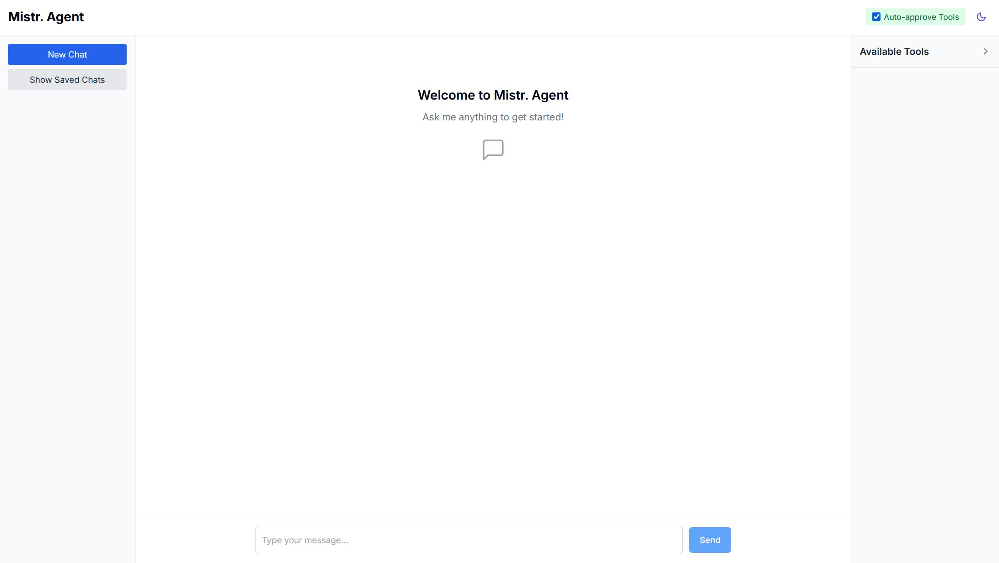
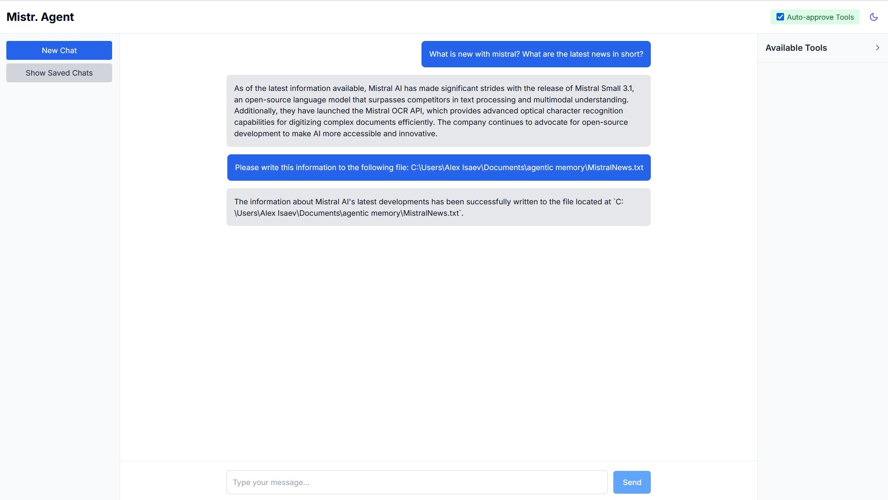
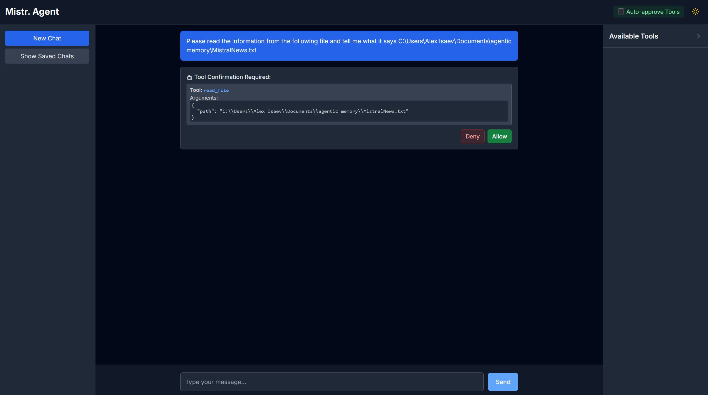

# Mistr. Agent  

A powerful autonomous MCP client for Mistral AI models with Model Context Protocol (MCP) integration, enabling AI-driven task execution across local and web environments.



## Overview

The Agentic MCP Client provides a modern interface that connects Mistral language models with real-world capabilities through the Model Context Protocol (MCP). It enables the LLM to autonomously perform tasks by orchestrating multiple tools across different environments - from searching the web to manipulating local files and executing system commands.

Unlike basic chat interfaces, this agent can maintain context across multi-step operations, self-correct when encountering errors, and provide security mechanisms for controlling tool access - creating truly agentic AI experiences with practical real-world applications.

## Screenshots

<table>
  <tr>
    <td></td>
    <td></td>
  </tr>
  <tr>
    <td>Tool Call Integration</td>
    <td>Dark Mode Interface</td>
  </tr>
</table>

## Core Capabilities

🧠 **Autonomous Task Execution**
- Multi-turn, multi-tool task completion with context maintenance
- Self-correction of tool usage when parameters are incorrect
- Sophisticated error handling with detailed feedback
- Tool state management across conversation turns

🛠️ **Tool Integration Framework**
- Dynamic loading of MCP servers and their capabilities
- Automatic tool discovery and capability negotiation
- Intelligent tool routing across multiple servers
- Enhanced tool descriptions with parameter validation

🔒 **Security & Control**
- Human-in-the-loop approval for sensitive operations
- Rate limiting for tool access
- Detection of potentially dangerous operations
- Detailed audit logging for all tool usage

💻 **System Integration**
- Terminal command execution and process management
- Local filesystem operations (read, write, list, search, edit)
- File content analysis and manipulation
- Cross-platform compatibility

🌐 **External Services**
- Web search via Perplexity AI integration
- Expandable to other API services through MCP
- Weather information retrieval
- Capability to add custom service integrations

## System Requirements

- **Internet Connection**: Required for API access to Mistral models and Perplexity search
- **Node.js**: v16.x or higher
- **RAM**: 4GB minimum (8GB recommended)
- **Storage**: 500MB for installation

The application can run locally with smaller models like Mistral 8B if you have access to them.

## Supported Models

All Mistral chat models are supported. The application has been tested and verified with:
- Mistral 8B
- Mistral Large

You can configure your preferred model in the settings.

## Architecture Overview

The Agentic MCP Client implements a modular architecture:

- **MCP Adapter**: Core orchestration layer connecting Mistral models to MCP servers
- **Server Manager**: Handles connections to multiple tool servers with capability negotiation
- **Tool Manager**: Registers and validates tools with enhanced schema information
- **Security Manager**: Controls tool access with approval workflows and validation
- **Modern UI**: React/Next.js interface with conversation management

## Installation

### From GitHub

1. **Clone the repository**
   ```bash
   git clone https://github.com/itisaevalex/mistr-agent.git
   cd mistr-agent
   ```

2. **Install dependencies**
   ```bash
   npm install
   ```

3. **Configure your API keys**
   ```bash
   # Create a .env.local file
   cp .env.example .env.local
   # Edit the file with your API keys
   ```

4. **Start the development server**
   ```bash
   npm run dev
   ```

5. **Access the application**
   Open http://localhost:3000 in your browser


## MCP Server Configuration

The agent connects to Model Context Protocol (MCP) servers to extend its capabilities. These servers are configured in the `mcp-config.json` file:

### Pre-Configured MCP Servers

#### 1. Perplexity Search Server

Provides web search capabilities using Perplexity AI's API:
```json
"perplexity-direct": {
  "type": "stdio",
  "name": "PerplexityDirect",
  "command": "uvx",
  "args": ["perplexity-mcp"],
  "env": {
    "PERPLEXITY_API_KEY": "your_perplexity_api_key_here",
    "PERPLEXITY_MODEL": "sonar"
  },
  "cwd": "/path/to/perplexity-mcp",
  "description": "Web search using Perplexity AI"
}
```

#### 2. Desktop Commander Server

Provides local system access with terminal and filesystem operations:
```json
"desktop-commander": {
  "type": "stdio",
  "name": "DesktopCommander",
  "command": "npx",
  "args": [
    "-y",
    "@wonderwhy-er/desktop-commander"
  ],
  "description": "Provides terminal, filesystem, and editing tools"
}
```

### Adding Custom MCP Servers

You can extend the agent's capabilities by adding your own MCP-compatible servers:

1. Install or set up the server process
2. Add a new entry to the servers object in mcp-config.json
3. Restart the development server

## Example Use Cases

The Agentic MCP Client excels at complex tasks spanning multiple tools:

- **Research Assistant**: Search the web for information, compile findings into local files, and generate summaries
- **Code Helper**: Search through local repositories, analyze code, execute tests, and explain results
- **System Administrator**: Monitor processes, execute commands, and manage files with natural language
- **Content Creator**: Research topics online and use the findings to create structured documents

## Advanced Configuration

### Tool Approval Workflow

The agent provides a UI toggle for "Auto Approve" which can be configured to:

- **Manual Mode**: Present tool calls to the user for approval before execution
- **Auto Mode**: Execute tool calls automatically without user confirmation

This allows granular control over which operations require human oversight.

### Adding New Capabilities

To extend the agent's capabilities:

1. Install additional MCP servers that provide the desired tools
2. Update your mcp-config.json to include the new servers
3. For custom tools, implement a new MCP server following the protocol specification

The project has been tested with the following MCP servers: 
- https://github.com/jsonallen/perplexity-mcp
- https://github.com/wonderwhy-er/DesktopCommanderMCP

## Contributing

Contributions are welcome! Key areas for improvement include:

- Additional MCP server integrations
- Enhanced security policies
- Improved tool orchestration
- UI enhancements for better visualization of tool operations
- Comprehensive testing across different environments

## License

This project is licensed under the MIT License - see the LICENSE file for details.
